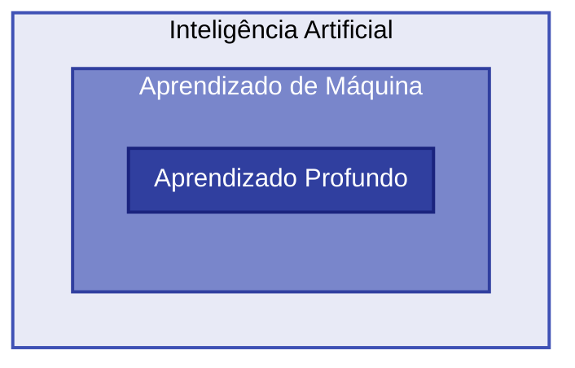

# AM

> Material didático para a aula introdutória de Aprendizagem de Máquina.
> Referência principal: *Mãos à obra: Aprendizado de Máquina com Scikit-Learn & TensorFlow* (Aurélien Géron).
> 
> 

---

## Slides

  <iframe loading="lazy" style="position: absolute; width: 100%; height: 100%; top: 0; left: 0; border: none; padding: 0;margin: 0;"
    src="https://www.canva.com/design/DAG_nWpwSE4/JP33j4HdvMDtUlNCFwwM2w/view?embed" allowfullscreen="allowfullscreen" allow="fullscreen">
  </iframe>

<a href="https:&#x2F;&#x2F;www.canva.com&#x2F;design&#x2F;DAG_nWpwSE4&#x2F;JP33j4HdvMDtUlNCFwwM2w&#x2F;view?utm_content=DAG_nWpwSE4&amp;utm_campaign=designshare&amp;utm_medium=embeds&amp;utm_source=link" target="_blank" rel="noopener">01</a> de Icaro Davies

## Ferramentas e Tecnologias

!!! abstract "Stack Tecnológica"
    - **Linguagem**: Python 3.14 
    - **Gerenciador de Pacotes**: UV 0.9.24 
    - **Interface de Comunicação**: FastAPI 
    - **Machine Learning Clássico**: Scikit-Learn 
    - **Deep Learning**: TensorFlow 
    - **Ambiente**: VS Code + Jupyter Notebooks 

---

## O que é Aprendizado de Máquina?

!!! info "Objetivos"
    - Diferenciar programação tradicional de Machine Learning
    - Compreender as definições históricas e técnicas do campo

!!! abstract "Conceitos-chave"
    - **Definição Abrangente**: É o campo de estudo que dá aos computadores a habilidade de aprender sem serem explicitamente programados (Arthur Samuel, 1959).
    - **Definição de Engenharia**: Um programa aprende com a **Experiência (E)** em relação a uma **Tarefa (T)** e uma medida de **Desempenho (P)**, se o seu desempenho em T melhora com E (Tom Mitchell, 1997).

### Mudança de Paradigma

Enquanto no software tradicional o computador segue instruções estritas (regras fixas) , no Aprendizado de Máquina ele atua como um **aprendiz de padrões**.

| Modelo | Entrada | Processo | Saída |
| --- | --- | --- | --- |
| **Tradicional** | Dados + Regras (IF/ELSE) | Execução | Respostas |
| **Machine Learning** | Dados + Respostas | Treinamento | **Regras (O Modelo)** |

---

## As Camadas da Inteligência Artificial

!!! abstract "Hierarquia"
    1. **Inteligência Artificial (IA)**: O campo amplo de máquinas que simulam inteligência humana.
    2. **Aprendizado de Máquina (AM)**: Subconjunto da IA que utiliza métodos estatísticos para aprender a partir de dados.
    3. **Aprendizado Profundo (AP/Deep Learning)**: Redes neurais complexas, o motor por trás de tecnologias como o ChatGPT.

---

## A Tabela de Mitchell (T, P, E)

Para que um sistema seja considerado Aprendizado de Máquina, ele deve ser decomposto nos três pilares de Tom Mitchell:

| Sigla | Conceito | Tradução / Exemplo (Filtro de Spam) |
| --- | --- | --- |
| **T** | Task (Tarefa) | O problema a ser resolvido (ex: Classificar se email é spam) |
| **P** | Performance | A métrica de sucesso (ex: % de precisão na classificação) |
| **E** | Experience | Os dados históricos processados (ex: 10 mil emails rotulados) |

> **Exemplo Prático: reCAPTCHA**
> Ao selecionar semáforos em uma imagem, você está gerando **Experiência (E)** para um algoritmo de visão computacional cuja **Tarefa (T)** é identificar objetos, melhorando a sua **Performance (P)** a cada clique.
> 
> 

---

## Exercícios de fixação

> Responda às questões abaixo para consolidar os conceitos introduzidos nesta aula.

<quiz>
Segundo Arthur Samuel (1959), o que define o Aprendizado de Máquina?

* [ ] A capacidade de seguir regras IF/ELSE complexas.
* [x] A habilidade de aprender sem ser explicitamente programado.
* [ ] A necessidade de um humano programar cada decisão do software.
</quiz>

<quiz>
Na Tabela de Mitchell, o que representa a "Experiência (E)"?

* [ ] A velocidade de processamento do computador.
* [ ] A quantidade de erros que o modelo comete.
* [x] Os dados históricos ou exemplos que o software processa.
</quiz>

<quiz>
Qual é a principal mudança de paradigma do Aprendizado de Máquina em relação ao algoritmo tradicional?

* [ ] O computador torna-se um "escravo de instruções".
* [x] O computador gera as "regras" (o modelo) a partir de dados e respostas.
* [ ] O computador para de utilizar lógica matemática.
</quiz>

<quiz>
O Deep Learning (Aprendizado Profundo) é classificado como:

* [ ] Um campo totalmente separado da Inteligência Artificial.
* [ ] O nível mais básico e simples de aprendizado estatístico.
* [x] Um subconjunto do Aprendizado de Máquina que utiliza redes neurais complexas.
</quiz>

<quiz>
Qual biblioteca mencionada é o padrão para Machine Learning clássico em Python?

* [ ] FastAPI
* [x] Scikit-Learn
* [ ] UV
</quiz>

<!-- mkdocs-quiz results -->