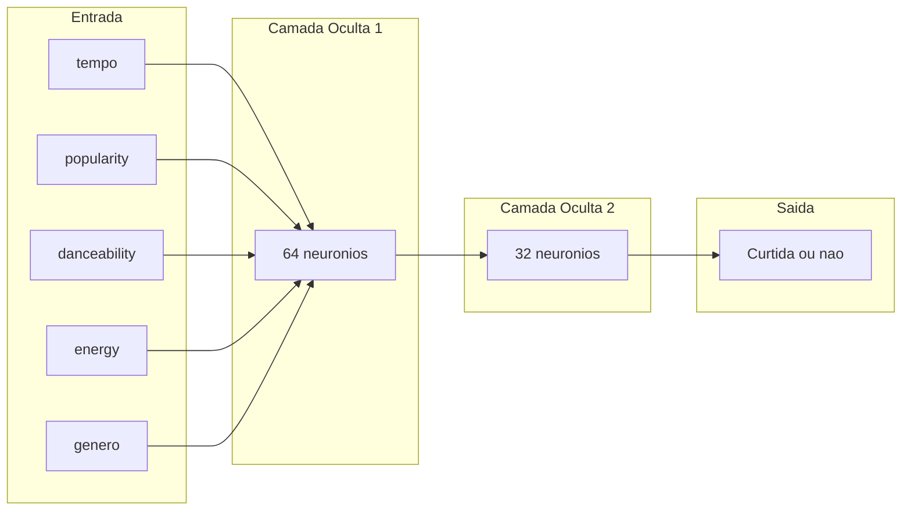

# Redes Neurais Multicamadas (MLP)

> Nas semanas anteriores construímos toda a infraestrutura: limpeza de dados, engenharia de atributos e um Perceptron simples. Chegou a hora de quebrar a barreira linear com as **Redes Neurais Multicamadas (MLP)**.

---


## Onde Estamos no Projeto

| Semana | O que construímos | Tipo |
|--------|-------------------|------|
| 02–03  | Perceptron (manual + NumPy) | Modelo linear simples |
| 04     | Limpeza de dados (Pandas) | Preparação |
| 05     | Feature Engineering (sklearn) | Transformação |
| **06** | **MLP (Rede Neural Real)** | **Modelo não-linear** |

---

## O Problema XOR — A Barreira do Perceptron

!!! info "Objetivos desta seção"
    * Compreender o que torna certos problemas **não-linearmente separáveis**.
    * Entender por que o Perceptron falha no XOR.

### O Cenário

Considere duas features binárias: `Energy` (alta=1 / baixa=0) e `Loudness` (alto=1 / baixo=0). A regra de recomendação é:

| Energy | Loudness | Recomendada? |
|--------|----------|:------------:|
| 0 | 0 | Não |
| 0 | 1 | Sim |
| 1 | 0 | Sim |
| 1 | 1 | Não |

**O que é XOR (OU exclusivo)?**

XOR é uma operação lógica em que o resultado é **verdadeiro apenas quando as duas entradas são diferentes**.

- Se as entradas forem iguais (`0,0` ou `1,1`) -> resultado `0` (Não).
- Se as entradas forem diferentes (`0,1` ou `1,0`) -> resultado `1` (Sim).

Tente desenhar **uma linha** que separe os "Sim" dos "Não" no gráfico abaixo:

```
  Loudness
    1 |  Sim(0,1)        Não(1,1)
    |
    0 |  Não(0,0)        Sim(1,0)
    +---------------------------→ Energy
         0               1
```

Repare que os pontos "Sim" ficam em diagonal e os pontos "Não" ocupam a diagonal oposta. Por isso nenhuma reta única consegue separar as classes corretamente.

**É impossível.** Não existe uma linha reta capaz de separar os "Sim" dos "Não" nesse padrão. Isso é o **problema XOR** e o Perceptron não tem como resolvê-lo.

!!! important "Por que isso importa na prática?"
    No mundo real, os padrões raramente são lineares. Uma música pode ser popular **tanto** por ser calma e acústica **quanto** por ser agitada e eletrônica, dois grupos que não cabem numa linha reta. O Perceptron simples não captura esse tipo de lógica.

---

## A Solução: Redes Neurais

!!! info "Objetivos desta seção"
    * Entender o que é uma rede neural.
    * Diferenciar Perceptron simples de rede neural multicamada.
    * Conhecer a arquitetura de camadas da MLP.

### O que é uma Rede Neural?

Uma **rede neural** é uma coleção de neurônios artificiais organizados em **camadas** e conectados entre si. Cada neurônio recebe as saídas dos neurônios da camada anterior, calcula sua própria soma ponderada e passa o resultado adiante.

O poder surge da **composição**: ao encadear camadas, a rede aprende representações progressivamente mais abstratas dos dados.

### O que é uma Rede Neural Multicamada (MLP)?

A **MLP** (*Multilayer Perceptron*) é o modelo mais clássico de rede neural profunda. Ela possui três tipos de camadas:

| Camada | Papel |
|--------|-------|
| **Entrada** (*Input Layer*) | Recebe as features — uma coluna por neurônio |
| **Oculta(s)** (*Hidden Layer(s)*) | Detecta padrões intermediários; pode haver uma ou mais |
| **Saída** (*Output Layer*) | Produz a previsão final (ex.: 0 = não curtida, 1 = curtida) |



### Exemplo em Projetos de PI

Em projetos de PI, a MLP pode ser vista como um pipeline de decisão em três etapas: **entrada de atributos**, **aprendizado de padrões intermediários** e **saída final**.

| Projeto de PI | Entrada (features) | O que as camadas ocultas aprendem | Saída |
|---------------|--------------------|-----------------------------------|-------|
| **Detecção de fungos em plantas** | textura da folha, cor, umidade, temperatura, pH, manchas na imagem | combinações como "mancha escura + alta umidade" ou "padrão de borda típico de fungo" | `fungo` / `sem fungo` |
| **Detecção de aves por áudio** | espectrograma, frequência dominante, energia por faixa, duração do canto | assinaturas acústicas de cada espécie, ruído de fundo vs. canto real, padrões temporais | espécie da ave (ou "ave detectada") |
| **Predição de risco para TDAH (triagem)** | atenção sustentada em tarefas, tempo de resposta, impulsividade, histórico escolar | relações não lineares entre comportamento, desempenho e contexto | `alto risco` / `baixo risco` |

!!! important "Projeto de saúde: cuidado com interpretação"
    Em temas como TDAH, o modelo deve ser usado para **triagem e apoio**, nunca como diagnóstico médico final. A decisão clínica precisa de profissional especializado.

### Como as Camadas Ocultas Resolvem o XOR?

Cada neurônio oculto aprende a responder a uma **partição** diferente do espaço de entrada. Na camada de saída, essas respostas parciais são combinadas. O resultado é uma fronteira de decisão **não linear**.


## Funções de Ativação

!!! info "Objetivos desta seção"
    * Entender para que servem as funções de ativação.
    * Conhecer Sigmoid, Tanh e ReLU.
    * Entender por que ReLU é o padrão moderno.

### Por que Precisamos de Funções de Ativação?

Sem uma função de ativação, cada camada faz apenas uma soma linear. Combinar várias somas lineares resulta em… outra soma linear. A rede seria equivalente a um único Perceptron, independentemente de quantas camadas você adicione.

As funções de ativação introduzem **não-linearidade**: permitem que a rede aprenda curvas e padrões complexos.

### As Três Funções Mais Importantes

Pense nessas funções como "filtros" que cada neurônio usa para decidir quanto sinal vai passar para a próxima camada.

=== "Sigmoid"

    $$\sigma(z) = \frac{1}{1 + e^{-z}}$$

    - Converte qualquer valor para o intervalo **0 a 1**.
    - É muito útil quando queremos uma saída em formato de **probabilidade**.
    - Hoje é mais comum na **camada de saída** de problemas binários (Sim/Não).

=== "Tanh"

    $$\tanh(z) = \frac{e^z - e^{-z}}{e^z + e^{-z}}$$

    - Converte para o intervalo **-1 a 1**.
    - É parecida com a Sigmoid, mas com valores negativos e positivos.
    - Aparece bastante em redes para dados sequenciais.

=== "ReLU (Padrão Moderno)"

    $$\text{ReLU}(z) = \max(0, z)$$

    - Regra simples: valor negativo vira **0**; valor positivo continua.
    - É rápida de calcular e funciona muito bem no treino.
    - Por isso é o **padrão** nas camadas ocultas da maioria das redes atuais.

!!! tip "Por que ReLU é tão poderosa?"
    Porque ela evita que o aprendizado "enfraqueça" demais nas camadas iniciais. Em termos práticos, isso ajuda a rede a aprender mais rápido e com mais estabilidade.

??? tip "Termo técnico: vanishing gradient"
    Esse nome significa que, durante o treino, as atualizações dos pesos ficam muito pequenas em algumas camadas. Quando isso acontece, a rede quase não melhora. A ReLU reduz bastante esse problema nas camadas ocultas.

---

## Como a MLP Aprende: Forward e Backpropagation

!!! info "Objetivos desta seção"
    * Entender o ciclo completo de aprendizado.
    * Compreender o papel da função de perda (*loss*).
    * Desenvolver intuição sobre backpropagation sem precisar de cálculo avançado.

### O Ciclo de Aprendizado em 4 Etapas

**Etapa 1 — Forward Pass (Ida)**

Os dados entram pela camada de entrada, percorrem cada camada oculta (somando pesos e aplicando a ativação) e chegam à camada de saída com uma previsão $\hat{y}$.

**Etapa 2 — Cálculo da Perda (Loss)**

Comparamos a previsão $\hat{y}$ com o label real $y$. A **função de perda** mede o quanto erramos. Para classificação binária, a mais comum é a *Binary Cross-Entropy*:

$$\mathcal{L} = -\frac{1}{n}\sum_{i=1}^{n}\left[y_i \log(\hat{y}_i) + (1 - y_i)\log(1 - \hat{y}_i)\right]$$

Quanto menor a loss, melhor a rede. O objetivo do treinamento é **minimizar** essa função.

**Etapa 3 — Backward Pass (Backpropagation)**

O erro é propagado de volta pela rede usando a regra da cadeia do cálculo diferencial. Cada peso recebe uma parcela de "culpa" pelo erro, calculada pelo **gradiente**. Os pesos são atualizados pelo otimizador:

$$w_i \leftarrow w_i - \eta \cdot \frac{\partial \mathcal{L}}{\partial w_i}$$

Onde $\eta$ (eta) é a **taxa de aprendizado** (*learning rate*): o tamanho do passo na atualização dos pesos.

**Etapa 4 — Repetição (Épocas)**

Os passos 1–3 se repetem para todos os dados de treino. Uma **época** é uma passagem completa pelo dataset. Após dezenas ou centenas de épocas, os pesos convergem para valores que minimizam o erro.

!!! tip "Analogia com basquete"
    Pense em alguém aprendendo a arremessar cestas. Cada arremesso errado dá informação: "força demais?", "ângulo errado?". A pessoa ajusta e tenta de novo. O backpropagation faz exatamente isso — mas com milhares de pesos ajustados ao mesmo tempo.

### O Otimizador Adam

O otimizador define **como** os pesos são atualizados a partir do gradiente. O **Adam** (*Adaptive Moment Estimation*) é o padrão moderno:

- Ajusta a *learning rate* individualmente para cada peso.
- Aprende mais rápido no início e vai refinando à medida que converge.
- É o padrão em `MLPClassifier` do scikit-learn.

??? tip "Outros otimizadores relevantes"
    | Otimizador | Característica |
    |-----------|----------------|
    | **SGD** | Clássico e simples; sensível à *learning rate* |
    | **RMSProp** | Precursor do Adam; bom para sequências |
    | **AdaGrad** | Bom para dados esparsos; *learning rate* cai demais ao longo do tempo |
    | **Adam** | Combina momentum e *learning rate* adaptativa; **padrão moderno** |


---

## Exercícios de Fixação

<quiz>
Por que o Perceptron simples não consegue resolver o problema XOR?

* [x] Porque ele só traça uma fronteira de decisão linear (reta/plano) e o XOR exige uma separação não-linear.
* [ ] Porque ele não tem função de ativação.
* [ ] Porque ele não possui pesos ajustáveis.
</quiz>

<quiz>
O que as camadas ocultas de uma MLP fazem que o Perceptron simples não consegue?

* [ ] Aplicam a mesma regra linear, mas mais rápido.
* [x] Introduzem não-linearidade, permitindo detectar padrões complexos que não são separáveis por uma linha reta.
* [ ] Aumentam o número de entradas do modelo.
</quiz>

<quiz>
Qual a principal vantagem da função ReLU sobre a Sigmoid nas camadas ocultas?

* [ ] A ReLU produz saídas entre 0 e 1, mais fáceis de interpretar.
* [x] A ReLU não sofre com o "vanishing gradient", permitindo que os pesos das camadas iniciais também sejam atualizados corretamente.
* [ ] A ReLU é mais precisa matematicamente que a Sigmoid.
</quiz>

<quiz>
O que acontece durante o Backpropagation?

* [ ] Os dados de entrada são transformados em números.
* [ ] A rede faz a previsão e retorna o resultado ao usuário.
* [x] O erro da previsão é propagado de volta pela rede, ajustando os pesos de cada neurônio para minimizar a perda.
</quiz>

<quiz>
No problema XOR, em quais casos a saída correta é "Sim"?

* [ ] Quando as duas entradas são iguais.
* [x] Quando as duas entradas são diferentes.
* [ ] Sempre que a primeira entrada for 1.
</quiz>

<quiz>
Em uma MLP para classificação binária, qual camada normalmente usa função Sigmoid?

* [ ] Camadas ocultas.
* [x] Camada de saída.
* [ ] Camada de entrada.
</quiz>

<quiz>
O que representa o gradiente durante o treinamento?

* [x] A direção e intensidade do ajuste dos pesos para reduzir o erro.
* [ ] O número de neurônios que a rede precisa adicionar.
* [ ] A quantidade de dados usada no treino.
</quiz>

<!-- mkdocs-quiz results -->

