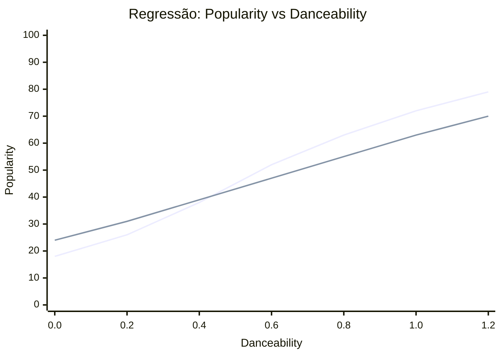

# Aprendizagem Preditiva com Regressão

Até agora, nossos modelos de IA respondiam perguntas do tipo "sim ou não":

- Perceptron (Semana 02): "Agitada ou calma?"
- MLP Classificador (Semana 06): "Curtida ou não curtida?"

Nesta semana, vamos prever um valor numérico contínuo: o Popularity Score (0 a 100) de uma música.

---

## Onde Estamos no Projeto

| Semana | Modelo | Pergunta | Tipo de Resposta |
|--------|--------|----------|------------------|
| 02-03 | Perceptron | "Agitada ou calma?" | Binário (0 ou 1) |
| 06 | MLP Classificador | "Curtida ou não curtida?" | Binário (0 ou 1) |
| 07 | MLP Regressor | "Qual o score de 0 a 100?" | Número contínuo |

!!! info "Objetivos da semana"
    - Diferenciar classificação e regressão no contexto de IA aplicada.
    - Treinar um `MLPRegressor` para prever popularidade musical.
    - Avaliar o modelo com métricas de regressão.
    - Integrar o modelo em endpoint FastAPI.

---

## Classificação vs. Regressão

Classificação e regressão resolvem problemas diferentes:

- Classificação prevê categorias (ex.: `Sim` ou `Não`).
- Regressão prevê valores contínuos (ex.: `42.7`).

**Analogia:**

- Classificação é como um professor que só pode dar `Aprovado` ou `Reprovado`.
- Regressão é como um professor que dá nota exata (6.1, 7.5, 9.8).

No nosso caso:

- Semana 06: "Essa música será curtida?" -> resposta categórica.
- Semana 07: "Qual o score de popularidade?" -> valor numérico.

### Intuição da reta de regressão

Na classificação, o modelo aprende uma fronteira de decisão. Na regressão, ele aprende uma reta (ou superfície em múltiplas dimensões) que minimiza o erro entre valor real e valor previsto.



!!! note
    Como interpretar:

    - A linha **Pontos observados** representa valores reais do dataset.
    - A linha **Reta de regressão** representa a tendência aprendida pelo modelo.
    - A distância vertical entre as linhas em cada ponto do eixo X é o erro de previsão.

    Os valores são ilustrativos para explicar o conceito de ajuste.

### Função de perda

Em regressão, o modelo precisa de um "termômetro" para saber se está melhorando ou piorando. Esse termômetro é a função de perda.

No fim de cada etapa de treino, ela responde à pergunta:

- "Quão longe minhas previsões ficaram dos valores reais?"

Se a perda diminui ao longo das épocas, o modelo está aprendendo.

Chamando de erro o valor $e = y_{real} - y_{previsto}$, as duas funções mais comuns são:

**MAE (Mean Absolute Error):**

$$MAE = \frac{1}{n} \sum_{i=1}^{n} |y_{real} - y_{previsto}|$$

O MAE mede o erro médio em pontos da escala original. Isso torna a interpretação direta: MAE = 8 significa "erro médio de 8 pontos".

**MSE (Mean Squared Error):**

$$MSE = \frac{1}{n} \sum_{i=1}^{n} (y_{real} - y_{previsto})^2$$

No MSE, o erro é elevado ao quadrado. Por isso, erros grandes passam a ter peso muito maior do que erros pequenos.

??? tip "Exemplo rápido com 3 músicas"
    Suponha os pares (real, previsto):

    - Música A: (50, 45) -> erro = 5
    - Música B: (70, 60) -> erro = 10
    - Música C: (30, 15) -> erro = 15

    Resultado das métricas nesse mini-exemplo:

    - MAE = $(5 + 10 + 15)/3 = 10$
    - MSE = $(5^2 + 10^2 + 15^2)/3 = (25 + 100 + 225)/3 = 116.67$

    Leitura prática:

    - MAE = 10 -> em média, erramos 10 pontos no score.
    - MSE = 116.67 -> o erro maior (15) pesa muito mais por causa do quadrado.

!!! tip "Como interpretar"
    Quando cada uma é mais usada:

    - MAE: relatórios para negócio/sala de aula, pois está na mesma unidade da saída (pontos de popularidade).
    - MSE: treinamento de modelos com gradiente (como redes neurais), pois pune mais erros grandes.

    Qual vamos usar nesta semana:

    - No treino do `MLPRegressor`: usamos erro quadrático (MSE) como base da otimização.
    - Na avaliação final: vamos reportar MAE, RMSE e R2 para interpretação didática.

    Exemplo de decisão em produção:

    - Se o problema tolera pequenos erros e quer comunicação simples: priorize MAE.
    - Se erros grandes são críticos priorize MSE/RMSE.

---

## Conceitos-Chave da Semana

### Data Leakage (Vazamento de Dados)

Na Semana 06, havia uma configuração que gerava vazamento:

```text
Features (X): [tempo, POPULARITY, danceability, energy, genero_*]
                         ↑
Label (Y):    liked = (POPULARITY > mediana)
                         ↑
              A RESPOSTA ESTÁ NA PERGUNTA
```

Nesta semana, corrigimos isso:

```text
Features (X): [danceability, energy, loudness, speechiness,
               acousticness, instrumentalness, liveness,
               valence, tempo]
Target (Y):   popularity (0-100)
```

!!! important "Regra de ouro"
    O target nunca deve estar nas features. Caso contrário, o modelo memoriza a resposta em vez de aprender padrão.

### Métricas de regressão

| Métrica | O que mede | Leitura prática |
|---------|------------|-----------------|
| MAE | Erro médio absoluto | "Em média, erro X pontos" |
| RMSE | Raiz do erro quadrático médio | "Erros grandes pesam mais" |
| R2 | Variação explicada pelo modelo | "Modelo explica X% dos dados" |

No dataset, cada música tem um score diferente: umas têm 10, outras têm 90. Essa diferença entre os scores é chamada de **variação**. O R2 mede **quanto dessa variação o modelo consegue reproduzir** usando as features.

**Exemplo concreto:**

- Dataset tem músicas com scores entre 10 e 90 (muita variação).
- Se R2 = 0.6: o modelo captura 60% do motivo pelo qual algumas músicas têm score alto e outras baixo.
- Os outros 40% são explicados por fatores fora do dataset (marketing, viralização, etc.).

O R2 responde à pergunta: **"O modelo é melhor do que simplesmente prever a média para todo mundo?"**

Imagine um modelo "burro" que ignora todas as features e responde sempre a mesma coisa: a média de popularidade do dataset (ex.: 45 pontos). Esse é o ponto de referência do R2.

$$R^2 = 1 - \frac{\sum (y_{real} - y_{previsto})^2}{\sum (y_{real} - \bar{y})^2}$$

Onde $\bar{y}$ é a média dos valores reais.

Interpretação do R2:

| Valor | Significado | Analogia |
|-------|-------------|----------|
| `R2 = 1.0` | Previsão perfeita | Acertou todos os scores exatos |
| `R2 = 0.7` | Modelo explica 70% da variação | Bom para dados com ruído |
| `R2 = 0.3` | Modelo explica 30% da variação | Fraco, mas melhor que nada |
| `R2 = 0.0` | Equivalente a prever a média | Modelo não aprendeu nada útil |
| `R2 < 0.0` | Pior que prever a média | Modelo atrapalha mais do que ajuda |

!!! note "Expectativa realista"
    Com features técnicas apenas, é normal obter R2 baixo e MAE moderado. Isso não invalida o modelo; mostra limite dos dados disponíveis.

### Por que popularidade é difícil de prever?

A popularidade depende de fatores que não estão no dataset técnico:

- Marketing da gravadora.
- Viralização em redes sociais.
- Momento cultural.
- Base de fãs do artista.
- Inserção em playlists relevantes.

---

## Pré-requisitos

Antes desta etapa, execute a limpeza da Semana 04:

```bash
uv run python scripts/clean_dataset.py
```

Arquivo necessário:

- `data/processed/dataset_clean.csv`

!!! note
    Nesta semana não usamos `dataset_features.csv` nem `transformers.joblib`. O regressor usa scaler próprio.

---

## Serviço de Regressão

Crie o arquivo `src/services/regression_model.py`:

```python
import numpy as np
import pandas as pd
from pathlib import Path
import joblib
from sklearn.neural_network import MLPRegressor
from sklearn.preprocessing import MinMaxScaler
from sklearn.metrics import mean_absolute_error, mean_squared_error, r2_score


class MusicPopularityRegressor:
    """
    Serviço de regressão usando Rede Neural Multicamadas (MLP).

    Usa o MLPRegressor do scikit-learn para prever o Popularity Score
    (valor contínuo de 0 a 100) de uma música com base nas suas
    características técnicas.
    """

    def __init__(self, model_dir: str | Path = "models"):
        self.model_dir = Path(model_dir)
        self.model_dir.mkdir(parents=True, exist_ok=True)
        self.model_path = self.model_dir / "regressor_model.joblib"
        self.scaler_path = self.model_dir / "regressor_scaler.joblib"
        self.model: MLPRegressor | None = None
        self.scaler: MinMaxScaler | None = None
        self.feature_names: list[str] | None = None
        self.metrics: dict | None = None

    def train(
        self,
        X_train: np.ndarray | pd.DataFrame,
        y_train: np.ndarray | pd.Series,
        hidden_layers: tuple = (64, 32),
        max_iter: int = 500,
        random_state: int = 42,
    ) -> "MusicPopularityRegressor":
        print(f"[REGRESSOR] Treinando rede neural com arquitetura {hidden_layers}...")
        print(f"[REGRESSOR] Features de entrada: {X_train.shape[1]} | Amostras: {X_train.shape[0]}")

        if isinstance(X_train, pd.DataFrame):
            self.feature_names = X_train.columns.tolist()

        self.scaler = MinMaxScaler()
        X_scaled = self.scaler.fit_transform(X_train)

        self.model = MLPRegressor(
            hidden_layer_sizes=hidden_layers,
            max_iter=max_iter,
            random_state=random_state,
            activation="relu",
            solver="adam",
            early_stopping=True,
            validation_fraction=0.1,
            verbose=False,
        )

        self.model.fit(X_scaled, y_train)
        self.save()
        print(f"[REGRESSOR] Treinamento concluído em {self.model.n_iter_} épocas.")
        return self

    def predict(self, X: np.ndarray | pd.DataFrame) -> dict:
        if self.model is None:
            self.load()

        X_scaled = self.scaler.transform(X)
        predictions = self.model.predict(X_scaled)
        predictions = np.clip(predictions, 0, 100)

        interpretations = []
        for p in predictions:
            if p >= 70:
                interpretations.append("Alta Popularidade")
            elif p >= 40:
                interpretations.append("Média Popularidade")
            else:
                interpretations.append("Baixa Popularidade")

        return {
            "predictions": predictions.round(1).tolist(),
            "interpretations": interpretations,
        }

    def evaluate(self, X_test: np.ndarray | pd.DataFrame, y_test: np.ndarray | pd.Series) -> dict:
        if self.model is None:
            self.load()

        X_scaled = self.scaler.transform(X_test)
        y_pred = self.model.predict(X_scaled)
        y_pred = np.clip(y_pred, 0, 100)

        mae = mean_absolute_error(y_test, y_pred)
        rmse = np.sqrt(mean_squared_error(y_test, y_pred))
        r2 = r2_score(y_test, y_pred)

        self.metrics = {"mae": round(mae, 2), "rmse": round(rmse, 2), "r2": round(r2, 4)}

        report = (
            f"  MAE  (Erro Médio Absoluto):      {mae:.2f} pontos\n"
            f"  RMSE (Raiz Erro Quadrático):      {rmse:.2f} pontos\n"
            f"  R2   (Variação Explicada):        {r2:.4f} ({r2 * 100:.1f}%)"
        )

        return {
            "mae": mae,
            "rmse": rmse,
            "r2": r2,
            "report": report,
        }

    def save(self):
        state = {
            "model": self.model,
            "scaler": self.scaler,
            "feature_names": self.feature_names,
            "metrics": self.metrics,
        }
        joblib.dump(state, self.model_path)
        print(f"[REGRESSOR] Modelo salvo em: {self.model_path}")

    def load(self):
        if not self.model_path.exists():
            raise FileNotFoundError(
                f"Modelo de regressão não encontrado em: {self.model_path}. "
                "Rode 'uv run python scripts/train_regression.py' primeiro."
            )
        state = joblib.load(self.model_path)
        self.model = state["model"]
        self.scaler = state["scaler"]
        self.feature_names = state.get("feature_names")
        self.metrics = state.get("metrics")
        print(f"[REGRESSOR] Modelo carregado de: {self.model_path}")
```

### Classificador vs. Regressor

| Aspecto | MLP Classificador | MLP Regressor |
|---------|-------------------|---------------|
| Classe sklearn | `MLPClassifier` | `MLPRegressor` |
| Saída | 0 ou 1 | 0.0 a 100.0 |
| Métricas | Accuracy, Precision, Recall | MAE, RMSE, R2 |
| Função de perda | Cross-Entropy | MSE |

!!! important
    Neste fluxo, o `MinMaxScaler` é interno ao serviço de regressão e salvo junto ao modelo.

---

## Script de Treinamento

Crie o arquivo `scripts/train_regression.py`:

```python
# -*- coding: utf-8 -*-
"""
Script de treinamento do regressor (Semana 07).
"""
import sys
import pandas as pd
from pathlib import Path
from sklearn.model_selection import train_test_split

project_root = Path(__file__).resolve().parent.parent
sys.path.insert(0, str(project_root))

from src.services.regression_model import MusicPopularityRegressor


NUMERIC_FEATURES = [
    "danceability",
    "energy",
    "loudness_norm",
    "speechiness",
    "acousticness",
    "instrumentalness",
    "liveness",
    "valence",
    "tempo",
]


def main():
    clean_path = project_root / "data" / "processed" / "dataset_clean.csv"

    print("=" * 60)
    print("  [REGRESSOR] Treinamento do Modelo de Regressão (Semana 07)")
    print("=" * 60)

    if not clean_path.exists():
        print(f"\n[ERRO] Dataset limpo não encontrado em: {clean_path}")
        print("DICA: Rode 'uv run python scripts/clean_dataset.py' primeiro.")
        return

    print("\n[1/5] Carregando dataset limpo...")
    df = pd.read_csv(clean_path)
    print(f"       Shape: {df.shape} ({df.shape[0]} músicas, {df.shape[1]} colunas)")

    print("\n[2/5] Separando features e target...")
    X = df[NUMERIC_FEATURES].copy()
    y = df["popularity"].copy()

    print(f"       Features (X): {list(X.columns)}")
    print("       Target (Y):   popularity")
    print(f"       Amostras:     {len(X)}")

    print("\n[3/5] Dividindo em treino (80%) e teste (20%)...")
    X_train, X_test, y_train, y_test = train_test_split(
        X, y, test_size=0.2, random_state=42
    )
    print(f"       Treino: {X_train.shape[0]} amostras")
    print(f"       Teste:  {X_test.shape[0]} amostras")

    print("\n[4/5] Treinando o Regressor MLP...")
    regressor = MusicPopularityRegressor()
    regressor.train(X_train, y_train, hidden_layers=(64, 32), max_iter=500)

    print("\n[5/5] Avaliando no conjunto de teste...")
    results = regressor.evaluate(X_test, y_test)

    print(f"\n{'=' * 60}")
    print("  RESULTADO FINAL")
    print(f"{'=' * 60}")
    print(results["report"])

    mae = results["mae"]
    r2 = results["r2"]
    print("\n  Interpretação:")
    print(f"  -> Erro médio de {mae:.1f} pontos no score de 0-100.")
    print(f"  -> Explica {r2 * 100:.1f}% da variação na popularity.")

    regressor.metrics = {
        "mae": round(mae, 2),
        "rmse": round(results["rmse"], 2),
        "r2": round(r2, 4),
    }
    regressor.save()


if __name__ == "__main__":
    main()
```

Execute:

```bash
uv run python scripts/train_regression.py
```

!!! note
    Resultado com MAE moderado e R2 baixo é esperado para esse cenário com poucas features explicativas.

---

## Endpoint da API

Crie o arquivo `src/api/v1/regression.py`:

```python
from fastapi import APIRouter, HTTPException, Depends
from typing import List
import pandas as pd
from pydantic import BaseModel, Field

from src.services.regression_model import MusicPopularityRegressor

router = APIRouter()


class RegressionTrackInput(BaseModel):
    """Dados de uma música para predição de Popularity Score."""
    track_name: str
    danceability: float = Field(ge=0, le=1, description="Quão dançável (0 a 1)")
    energy: float = Field(ge=0, le=1, description="Intensidade e atividade (0 a 1)")
    loudness_norm: float = Field(ge=0, le=1, description="Volume normalizado (0 a 1)")
    speechiness: float = Field(ge=0, le=1, default=0.05, description="Presença de voz falada (0 a 1)")
    acousticness: float = Field(ge=0, le=1, default=0.5, description="Quão acústica (0 a 1)")
    instrumentalness: float = Field(ge=0, le=1, default=0.0, description="Quão instrumental (0 a 1)")
    liveness: float = Field(ge=0, le=1, default=0.2, description="Presença de audiência ao vivo (0 a 1)")
    valence: float = Field(ge=0, le=1, default=0.5, description="Positividade musical (0 a 1)")
    tempo: float = Field(ge=0, le=300, default=120.0, description="BPM da música")


class RegressionPredictRequest(BaseModel):
    tracks: List[RegressionTrackInput]


class RegressionTrackResult(BaseModel):
    track_name: str
    predicted_popularity: float
    interpretation: str
    confidence_range: dict
    debug: dict


class RegressionPredictResponse(BaseModel):
    results: List[RegressionTrackResult]
    total: int
    model_info: dict


def get_regressor() -> MusicPopularityRegressor:
    regressor = MusicPopularityRegressor()
    regressor.load()
    return regressor


@router.post("/model/regression/predict", response_model=RegressionPredictResponse)
def regression_predict(
    request: RegressionPredictRequest,
    regressor: MusicPopularityRegressor = Depends(get_regressor),
):
    try:
        feature_columns = [
            "danceability", "energy", "loudness_norm", "speechiness",
            "acousticness", "instrumentalness", "liveness", "valence", "tempo",
        ]

        rows = []
        for t in request.tracks:
            rows.append({
                "danceability": t.danceability,
                "energy": t.energy,
                "loudness_norm": t.loudness_norm,
                "speechiness": t.speechiness,
                "acousticness": t.acousticness,
                "instrumentalness": t.instrumentalness,
                "liveness": t.liveness,
                "valence": t.valence,
                "tempo": t.tempo,
            })

        df = pd.DataFrame(rows, columns=feature_columns)
        result = regressor.predict(df)

        mae = regressor.metrics.get("mae", 15.0) if regressor.metrics else 15.0
        results = []

        for i, track in enumerate(request.tracks):
            pred = result["predictions"][i]
            interp = result["interpretations"][i]

            results.append(RegressionTrackResult(
                track_name=track.track_name,
                predicted_popularity=pred,
                interpretation=interp,
                confidence_range={
                    "min": round(max(0, pred - mae), 1),
                    "max": round(min(100, pred + mae), 1),
                },
                debug={
                    "features_used": feature_columns,
                    "feature_values": df.iloc[i].to_dict(),
                },
            ))

        model_info = regressor.metrics or {"mae": "N/A", "rmse": "N/A", "r2": "N/A"}

        return RegressionPredictResponse(
            results=results,
            total=len(results),
            model_info=model_info,
        )

    except FileNotFoundError as e:
        raise HTTPException(
            status_code=503,
            detail=f"Modelo de regressão não encontrado. Rode 'uv run python scripts/train_regression.py' primeiro. Erro: {e}",
        )
    except Exception as e:
        raise HTTPException(status_code=500, detail=str(e))
```

---

## Registro de Rotas

No arquivo `src/api/v1/router.py`, inclua o módulo de regressão:

```python
from src.api.v1 import recommendation, library, data_audit, feature_engineering, mlp, regression

api_router.include_router(regression.router, tags=["regression-prediction"])
```

---

## Teste no Swagger

1. Suba o servidor:

```bash
uv run fastapi dev
```

2. Acesse `http://127.0.0.1:8000/docs`.
3. Use o endpoint `POST /api/v1/model/regression/predict`.
4. Teste com o JSON:

```json
{
  "tracks": [
    {
      "track_name": "In the End",
      "danceability": 0.6,
      "energy": 0.8,
      "loudness_norm": 0.79,
      "speechiness": 0.05,
      "acousticness": 0.03,
      "instrumentalness": 0.0,
      "liveness": 0.1,
      "valence": 0.4,
      "tempo": 105.0
    }
  ]
}
```

---

## Notebook de Comparação

No notebook `notebooks/07_regressao_comparacao.ipynb`, compare valor real e previsto em músicas reais.

Fluxo sugerido:

- Carregar modelo treinado e dataset.
- Sortear amostras aleatórias.
- Prever com apenas features técnicas.
- Comparar com popularidade real.
- Visualizar erros com gráficos.

!!! important
    Erros maiores em músicas virais são esperados, porque variáveis sociais não estão no dataset técnico.

---

## Semana 06 vs. Semana 07

| Aspecto | Semana 06 (Classificação) | Semana 07 (Regressão) |
|---------|----------------------------|------------------------|
| Modelo | `MLPClassifier` | `MLPRegressor` |
| Pergunta | "Curtida ou não?" | "Qual o score?" |
| Saída | 0 ou 1 | 0.0 a 100.0 |
| Data Leakage | Sim | Não |
| Métricas | Accuracy, Precision, Recall | MAE, RMSE, R2 |
| Lição | IA pode memorizar regra | IA tem limites com dados incompletos |

---