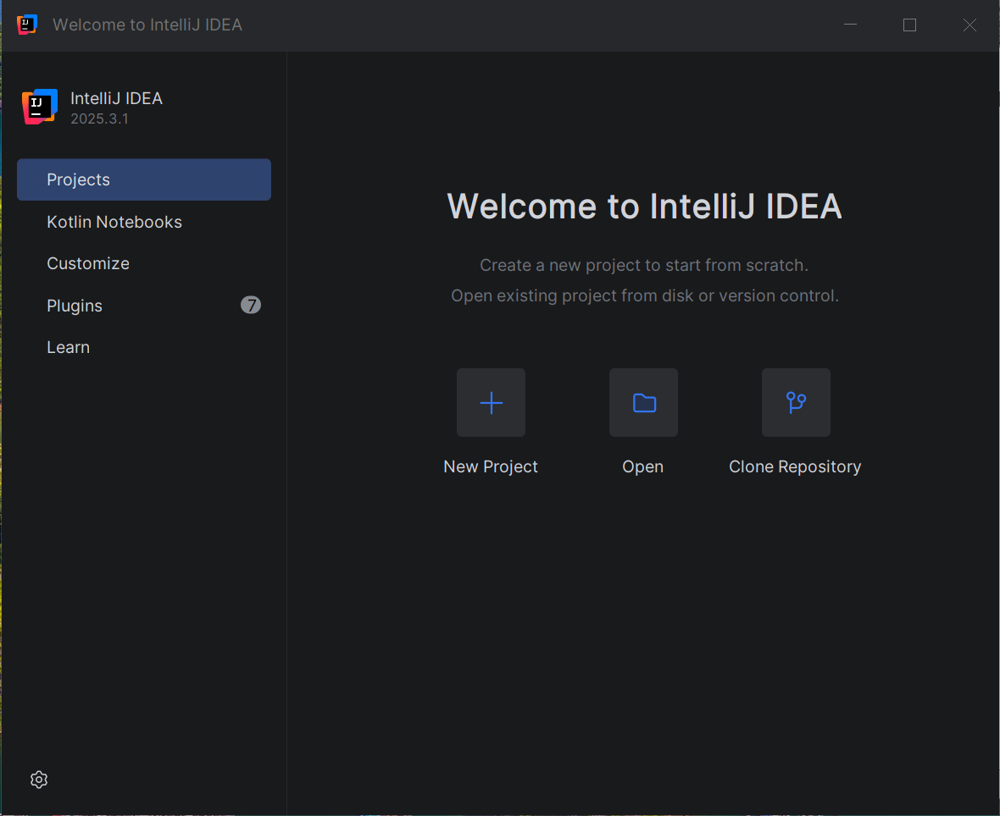
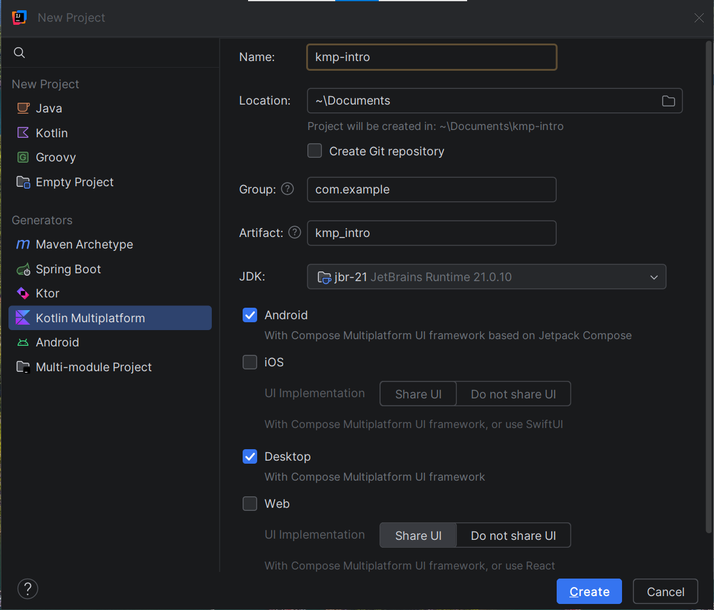
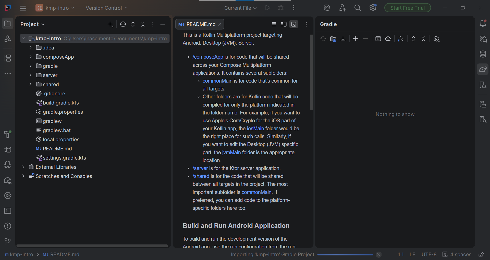
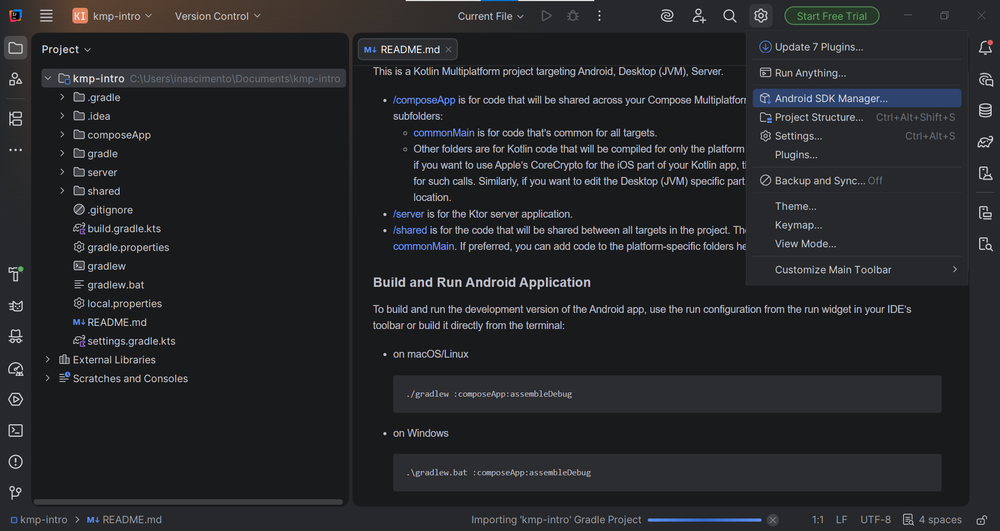

# Configuração do Ambiente

---

## Configuração do IntelliJ IDEA

!!! info "Por que IntelliJ?"
    O IntelliJ IDEA (versão Community ou Ultimate) oferece suporte nativo para Kotlin Multiplatform Wizard e Development.

!!! warning "Versão do IntelliJ"
    Certifique-se de utilizar a versão **2025.3.1** (ou superior), pois ela contém o suporte atualizado para o plugin KMP que utilizaremos. Versões anteriores podem não apresentar as mesmas opções no Wizard.

### Passo a Passo

Siga os passos abaixo, expandindo cada bloco para ver os detalhes.

??? quote "1. Instalação do Plugin (KMP)"

    Abra o IntelliJ IDEA e siga os passos abaixo:

    * Verifique se está na versão **2025.3.1** (ou superior).

    

    * Acesse o menu de `plugins`.
    * Busque por "KMP" e clique em `install`.

    

    !!! warning "Reinicie o IntelliJ"
        **Atenção**: Reinicie o IntelliJ para que as alterações surjam.

    !!! bug "Erro de Plugin"
        **Atenção**: Em caso de erro, tente reinstalar o plugin. Ou instalar o plugin manualmente que aparece no erro.
        Exemplo: `androidx.compose.ui:ui-tooling-preview:1.5.3` ou `intellij.webp' to be installed`.

??? quote "2. Criar um novo Projeto (KMP Wizard)"

    Utilize o KMP Wizard para começar com a estrutura correta.
    
    * Clique em  `New Project` no menu lateral selecione `Kotlin Multiplatform`.

    

    * Insira um **nome** para o projeto.
    * Em `Location` insira o **caminho** para salvar o projeto.
    * Em `JDK` Selecione a versão **jbr-21 JetBrains Runtime 21.0.10**.
    * Logo abaixo marque as opções `Android`, `Desktop` e `Server` e desmarque as opções `iOS` e `include tests`.
    
    Clique em `Create` para iniciar a criação do projeto.

??? quote "3. Gradle Sync"

    Após criar o projeto, o IntelliJ iniciará o processo de sincronização do Gradle.
    
    * Observe a barra inferior para acompanhar o progresso.
    * Ao abrir o projeto caso solicitado, selecione o SDK do Android na pasta `C:\Sdk`.
    * Em caso de erro no build ou sincronização, tente reiniciar sincronizar novamente o projeto na barra de ferramentas do gradle (Sync All Gradle Projects - Primeiro icone a esquerda do painel).
    
    

??? quote "4. Verificar o Ambiente"

    Para verificar se está tudo configurado corretamente:
    
    * No canto superior direito, clique no icone de configuração e selecione `Android SDK Manager...`

    

    * Verifique se o Android SDK localizado na pasta `C:\Sdk` está instalado.

    

    * Verifique também em `Build, Execution, Deployment` > `Build Tools` > `Gradle` se o Gradle JVM está instalado com a versão **jbr-21 JetBrains Runtime 21.0.10**.

    

??? quote "5. Executar o Ambiente Completo"

    Agora vamos rodar a aplicação.

    !!! info "Nessa etapa, o celular já deve estar conectado e exibindo o nome do dispositivo"
        
    
    * Selecione o módulo `composeApp` na configuração de execução.
    * Clique no botão **Run** (Play verde).
    * O aplicativo deve ser instalado e iniciado no seu dispositivo.
    * Inicie também o módulo `composeApp[jvm]` (Desktop) e `ApplicationKt` (Server API) na configuração de execução.

    

## Prática

Crie um novo projeto para verificar se o ambiente está configurado corretamente.

